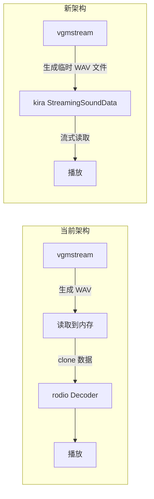

# 将 rodio 替换为 kira 实现流式音频播放

## 问题分析

当前 rodio 的性能瓶颈：

- 每次播放需要将整个 WAV 文件（可能 100MB+）加载到内存
- 每次 seek 需要重新解码整个文件
- `Decoder::new(Cursor<Vec<u8>>)` API 强制要求内存中的完整数据

## 解决方案

使用 **kira** 库的 **StreamingSoundData** 模式：

- 直接从磁盘流式读取音频文件
- 不需要把整个文件加载到内存
- seek 操作只需要调整文件指针，不需要重新解码

## 架构变更



## 需要修改的文件

### 1. [Cargo.toml](E:\research\EXVS2-Audio-Editor\Cargo.toml)

- 移除 `rodio` 依赖
- 添加 `kira` 和 `kira-loaders` 依赖
```toml
# 移除
rodio = "0.17.1"

# 添加
kira = "0.11"
```


### 2. [native.rs](E:\research\EXVS2-Audio-Editor\src\ui\audio_player\audio_backend\native.rs)

完全重写音频后端：

- 使用 `kira::manager::AudioManager` 管理音频
- 使用 `StreamingSoundData::from_file()` 直接从文件路径流式播放
- 保存临时文件路径而不是内存数据

关键 API 变更：

```rust
// 旧: 传入内存数据
fn play_audio(&mut self, data: Arc<Vec<u8>>) -> Result<(), String>

// 新: 传入文件路径
fn play_audio(&mut self, file_path: &str) -> Result<(), String>
```

### 3. [trait_def.rs](E:\research\EXVS2-Audio-Editor\src\ui\audio_player\audio_backend\trait_def.rs)

更新 `AudioBackend` trait 签名：

- `play_audio` 改为接收文件路径而非内存数据

### 4. [audio_state.rs](E:\research\EXVS2-Audio-Editor\src\ui\audio_player\audio_state.rs)

- `AudioFile` 结构体改为存储临时文件路径
- `toggle_play` 传递文件路径而非数据

### 5. [audio_player_component.rs](E:\research\EXVS2-Audio-Editor\src\ui\audio_player\audio_player_component.rs)

- 不再将 WAV 数据读入内存
- 直接保存 vgmstream 生成的临时文件路径
- 修改 `load_audio` 流程

### 6. [export_utils.rs](E:\research\EXVS2-Audio-Editor\src\ui\main_area\export_utils.rs)

- 新增方法返回临时文件路径而非读取数据
- 或修改现有方法返回路径

## 性能对比

| 操作 | rodio (100MB 文件) | kira 流式播放 |

|------|-------------------|---------------|

| 初次播放 | 数十秒（加载+解码） | 毫秒级（只读 header） |

| Seek | 数秒（重新解码） | 毫秒级（调整文件指针） |

| 内存占用 | ~100MB+ | ~几 KB 缓冲区 |

## 注意事项

- 临时文件需要在适当时机清理（切换曲目或退出时）
- kira 的 seek API 可能与 rodio 略有不同，需要适配
- 需要处理文件不存在或被删除的边缘情况