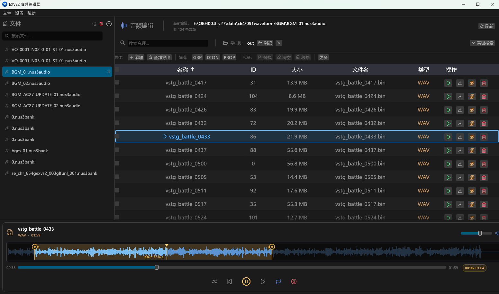
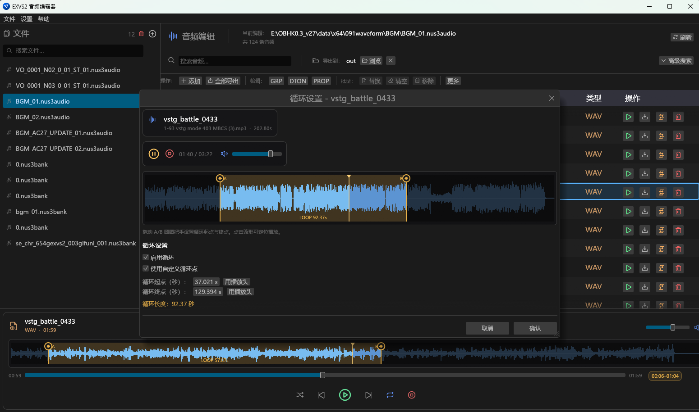

# EXVS2 Audio Editor

<p align="center">
  
</p>

<p align="center">
  <strong>A desktop GUI for editing NUS3AUDIO / NUS3BANK audio used in EXVS2 (Extreme VS 2)</strong>
</p>

<p align="center">
  
  
  
  <a href="https://www.buymeacoffee.com/kjjkjjzyayx">
    
  </a>
</p>

Extract, preview, replace, and export game audio tracks with loop-point control and NUS3BANK section editing.

## 📸 Screenshots

| Main window | Loop settings |
|:-----------:|:-------------:|
|  |  |

## ✨ Features

- **File management** — Open NUS3AUDIO and NUS3BANK containers and browse tracks
- **Playback** — Built-in player with waveform preview (NUS3AUDIO + NUS3BANK)
- **Export** — Export selected tracks to WAV
- **Replace** — Swap track data with your own audio (with optional gain + loop processing)
- **NUS3BANK sections** — Edit PROP, DTON, and GRP for EXVS2 banks
- **Loop tools** — Custom A–B loop points via vgmstream-assisted processing
- **Search & sort** — Filter large banks; next/prev playback follows table order
- **Add / remove** — Add or mark tracks for removal in supported containers

## 💻 System Requirements

- **Windows** 10 or newer recommended

## 📦 Installation

1. Download the latest release from the [Releases](https://github.com/kjjkjjzyayufqza/EXVS2-Audio-Editor/releases) page
2. Extract the ZIP to a folder of your choice
3. Run `exvs2_audio_editor.exe`

## 🚀 Usage

### Open a container

1. Click **Add File** in the file list panel
2. Choose a `.nus3audio` or `.nus3bank` file
3. Tracks appear in the main table

### Play a track

1. Select a row and click **Play** (or use the bottom player)
2. Use transport controls for pause, next/previous, shuffle, and queue repeat
3. If a track has loop metadata, use the amber **A–B chip** on the player to honor or ignore in-file loop points

### Export

1. Select one or more tracks
2. Click **Export** and pick an output folder
3. Files are written as WAV

### Replace audio

1. Select a track → **Replace**
2. Choose a source audio file
3. Configure loop / gain in the loop settings dialog if needed
4. Apply — changes stay in memory until you **Save**

#### Loop settings


- **Enable Loop** — Toggle loop-point processing
- **Use Custom Loop Points** — Set start/end in seconds
- **Gain (dB)** — Volume adjust (−20 … +20)

When both gain and loop processing are on: gain is applied first, then loop processing.

### Save

1. Click **Save** after edits
2. Choose the output path for the modified container  
   (original file is not overwritten unless you choose that path)

## 🛠️ Tools Used

- **vgmstream-cli** — Decode/encode game audio and loop handling
- **kira** — Native audio playback
- **hound** — WAV I/O and gain adjustment
- **egui / eframe** — Desktop UI

## 📝 Implementation Notes

### NUS3BANK support

Partial but usable support for EXVS2 NUS3BANK, informed by [Smash-Forge's NUS3BANK.cs](https://github.com/jam1garner/Smash-Forge/blob/master/Smash%20Forge/Filetypes/Sounds/NUS3BANK.cs).

- TOC / TONE mapping
- Audio replace into TONE payload
- PROP / DTON / GRP editing
- Basic add / remove of tracks

> ⚠️ **Experimental** — Always keep backups of original banks before saving.

## 🔧 Development

**Prerequisites:** Rust 1.97+, Cargo

```bash
git clone https://github.com/kjjkjjzyayufqza/EXVS2-Audio-Editor.git
cd EXVS2-Audio-Editor

cargo build --release
cargo run --release
```

## 📄 License

Dual-licensed:

- [MIT](LICENSE-MIT)
- [Apache-2.0](LICENSE-APACHE)

## 🙏 Acknowledgements

- [egui](https://github.com/emilk/egui) — Immediate-mode GUI for Rust
- [nus3audio](https://crates.io/crates/nus3audio) — NUS3AUDIO crate
- [vgmstream](https://github.com/vgmstream/vgmstream) — Game audio streaming toolkit

## 🤖 AI Assistance

Parts of this project were developed with AI assistance.

## ☕ Support

If this tool helps you, consider buying me a coffee:

[](https://www.buymeacoffee.com/kjjkjjzyayx)

https://www.buymeacoffee.com/kjjkjjzyayx

## 🤝 Contributing

Contributions are welcome — feel free to open a Pull Request.
